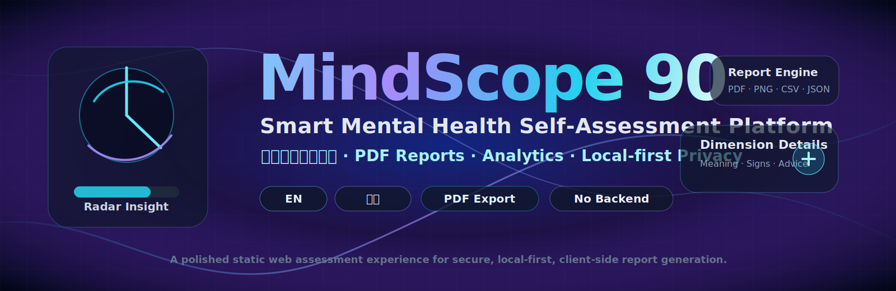

<div align="center">
  

  # SCL-90 Online Assessment System

  ### Licensed Symptom Checklist-90 Web Assessment · PDF Report · One-Time Access Codes

  [English](README.md) · [简体中文](README_CN.md)

  <p>
    
    
    
    
  </p>

  **A polished web-based SCL-90 self-report assessment system with authorized question content, automated scoring, visual analytics, detailed dimension interpretation, downloadable reports, and optional one-time access-code verification for paid distribution.**
</div>

---

## Overview

This project is a deployable SCL-90 web assessment system. It includes:

- 90-item SCL-90 questionnaire flow
- 1–5 response scale
- required-answer validation
- total score and mean score
- GSI, PST, and PSDI global indices
- 10-factor dimension scoring, including additional sleep/appetite items
- expandable clinical-style dimension explanations
- PDF report export
- chart PNG export
- CSV / JSON / ZIP data export
- optional Cloudflare Worker + KV one-time access-code backend
- standalone admin page for generating, importing, listing, and exporting access codes

> The system is intended for psychological screening and self-reflection. It is not a medical diagnosis, treatment recommendation, or emergency intervention service.

---

## Project Structure

```text
.
├── index.html                  # Main assessment page
├── styles.css                  # UI design and responsive layout
├── app.js                      # SCL-90 questions, scoring, charts, report export, access-code logic
├── admin.html                  # Access-code management panel
├── README.md                   # English README
├── README_CN.md                # Chinese README
├── assets/
│   └── mindscope90-hero.svg    # README hero banner
└── worker/
    ├── worker.js               # Cloudflare Worker backend for one-time codes
    └── wrangler.toml           # Worker deployment configuration
```

---

## Scoring Notes

The web app outputs both common Chinese raw-score indicators and international SCL-90-R style global indices.

| Indicator | Meaning |
| --- | --- |
| Total score | Sum of all 90 raw item scores, using the 1–5 response system. |
| Mean score | Total score divided by 90. |
| Positive item count / PST | Number of items scored above 1. |
| GSI | Global Severity Index, computed after converting raw 1–5 responses to 0–4 scores. |
| PSDI | Positive Symptom Distress Index, the average intensity among endorsed symptoms. |
| Factor score | Mean score of items belonging to each SCL-90 factor. |

The default screening rule is configurable in `app.js`:

```js
screeningRules: {
  totalPositiveCutoff: 160,
  positiveItemCutoff: 43,
  factorMeanCutoff: 2
}
```

For formal clinical or institutional use, replace or extend these rules with the norm tables and interpretation standards from your authorized manual.

---

## Local Demo Mode

By default, the project runs in local demo mode:

```js
const CONFIG = {
  accessMode: "local",
  localAccessCode: "CHANGE_ME_LOCAL_CODE"
};
```

This is suitable only for testing. A local front-end access code can be seen by users who inspect the source code.

---

## One-Time Access-Code Mode

For Taobao or paid QR-code distribution, use server-side verification:

```js
const CONFIG = {
  accessMode: "api",
  apiBase: "https://YOUR-WORKER-NAME.YOUR-SUBDOMAIN.workers.dev"
};
```

After a user enters a valid code, the backend marks that code as `used`. The same code cannot be redeemed again.

---

## Deploy the Website to GitHub Pages

1. Upload these files to your GitHub repository root:

```text
index.html
styles.css
app.js
admin.html
README.md
README_CN.md
assets/
worker/
```

2. Open the repository on GitHub.
3. Go to **Settings → Pages**.
4. Set **Source** to `Deploy from a branch`.
5. Select branch `main` and folder `/root`.
6. Wait for the live URL.

Your site will look like:

```text
https://YOUR_GITHUB_USERNAME.github.io/YOUR_REPOSITORY_NAME/
```

---

## Deploy the Access-Code Backend with Cloudflare Workers

### 1. Install Wrangler

```bash
npm install -g wrangler
wrangler login
```

### 2. Create KV namespace

```bash
cd worker
npx wrangler kv namespace create ACCESS_CODES
```

Copy the generated namespace ID into `worker/wrangler.toml`:

```toml
[[kv_namespaces]]
binding = "ACCESS_CODES"
id = "YOUR_KV_NAMESPACE_ID"
```

### 3. Set admin token

```bash
npx wrangler secret put ADMIN_TOKEN
```

Enter a strong private token. This token is required by `admin.html`.

### 4. Deploy Worker

```bash
npx wrangler deploy
```

After deployment, update `app.js`:

```js
accessMode: "api",
apiBase: "https://YOUR-WORKER-NAME.YOUR-SUBDOMAIN.workers.dev"
```

---

## Use the Admin Panel

Open:

```text
https://YOUR_GITHUB_USERNAME.github.io/YOUR_REPOSITORY_NAME/admin.html
```

Fill in:

- Worker API URL
- Admin Token

Then you can:

- generate access codes
- import existing codes
- list valid codes
- list used codes
- export access codes as CSV

Do not share the Admin Token with users.

---

## Taobao Workflow

```text
Buyer places an order on Taobao
↓
You generate or copy one unused access code from admin.html
↓
Send the code to the buyer
↓
Buyer scans the GitHub Pages QR code
↓
Buyer enters the code
↓
Backend marks the code as used
↓
Buyer completes SCL-90 assessment and downloads PDF report
```

---

## Safety Disclaimer

This system is not a diagnostic product. If the report identifies high distress, self-harm thoughts, harm-to-others impulses, psychotic-like experiences, or severe functional impairment, the user should contact qualified mental health professionals or local emergency services immediately.

---

## License and Scale Authorization

This codebase is a technical implementation package. The question content, norm tables, scoring standards, commercial distribution rights, and professional-use requirements must be handled according to your own SCL-90 authorization documents and local regulatory obligations.
